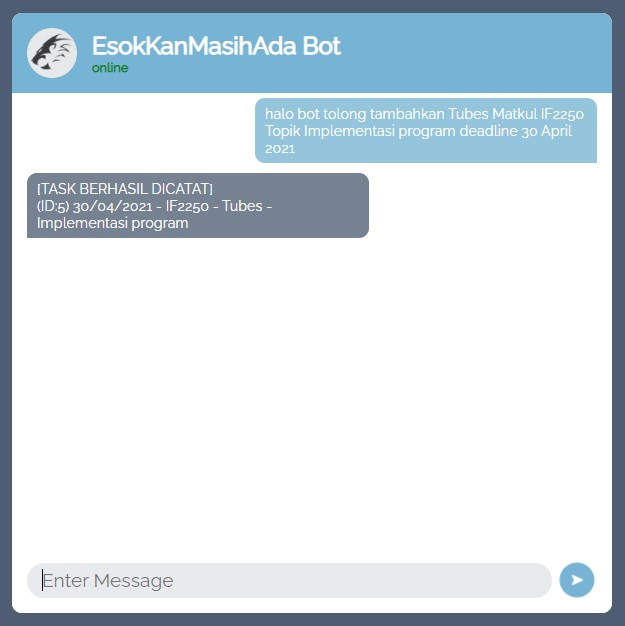

# Deadline Bot

> Program ini dibuat untuk memenuhi Tugas Besar 3 IF2211 Strategi Algoritma Program Studi Informatika ITB.

## Table of contents

* [General info](#general-info)
* [Screenshots](#screenshots)
* [Technologies](#technologies)
* [Setup](#setup)
* [Author](#author)

## General info

Program ini adalah program yang akan mencatat daftar deadline tugas yang diinput oleh user. Program ini mendeteksi keyword dengan menggunakan string matching KMP dan regex.

## Screenshots

## Technologies

* HTML/CSS
* Javascript
* Python/Flask

## Setup

## Status

Project is: _on going_

## Author

Created by  
[13519100 - Aulia Adila](https://github.com/auliaadila)  
[13519155 - Giovani Anggasta](https://github.com/giovaniagst)  
[13519192 - Gayuh Tri Rahutami](https://github.com/wundersmith)
